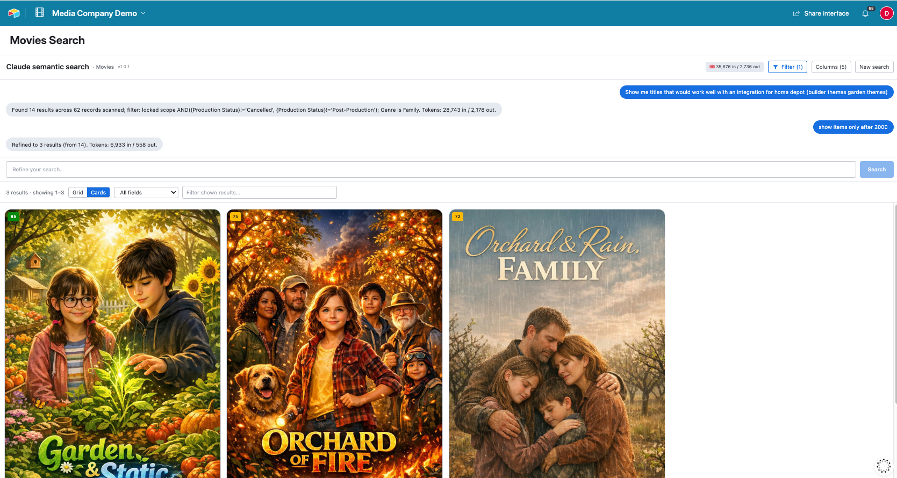

# Airtable AI Interface: Claude Semantic Search

Airtable's search matches text. It doesn't understand what you mean. Ask it "which of these are a good fit for X" and it just blinks at you.

This is a custom Airtable **interface extension** that adds AI semantic search to any base, in any industry. Point it at a table, and anyone using the interface can search in plain language: Claude reads the actual records, ranks them by relevance with a score and a one-line reason, and hands back a sortable, filterable grid (or image-forward cards). The Anthropic key and your Airtable token never touch the browser.

It ships with a movie-catalog demo, but nothing about it is movie-specific. Set the table, the fields, and an optional **skill** that teaches Claude about your data, and it works the same for CRM records, research libraries, product catalogs, case files, applicants, inventory, whatever you keep in Airtable.



## How it works

Two pieces, one rule: **the keys stay server-side.**

```
┌─────────────────────────────────────┐        ┌──────────────────────────────┐
│  Airtable Interface Extension        │        │  Cloudflare Worker (proxy)   │
│  (@airtable/blocks, React)           │ HTTPS  │  secrets, server-side only:  │
│                                      │ ─────► │   • ANTHROPIC_API_KEY        │
│  • Chat-style search + re-prompt     │  POST  │   • AIRTABLE_PAT             │
│  • Filter (scope) + record filters   │ /search│                              │
│  • Grid / card results, sort/filter  │ ◄───── │  1. clarify ambiguous intent │
│  • Live token counter                │  page  │  2. fetch a page (Airtable)  │
└─────────────────────────────────────┘        │  3. Claude re-ranks the page │
                                                └──────────────────────────────┘
```

The extension is thin on purpose. It sends your prompt and config, then pages through the records and appends results as they come back. The Worker holds both secrets and does the thinking: it fetches each page from the Airtable REST API, sends it to Claude (Haiku 4.5, with structured outputs so the JSON is always valid), and gets back a relevance score and a short reason for every record.

Routing through a Worker keeps the Anthropic key and the Airtable token off the browser, and gives you real offset pagination instead of loading a whole table into memory.

## What you can do

- **Search any table in plain language** and get relevance-ranked results with reasons.
- **Teach it your domain** with a free-text *skill* (e.g. "these are support tickets; rank by how urgent and unresolved they look").
- **Two-layer filtering:** a builder-set **locked scope** everyone sees but can't edit, plus per-user filters on top.
- **Grid or card layout** — cards feature a configurable image field.
- **Refine in place:** a follow-up prompt re-ranks the current results cheaply instead of re-scanning.
- **Cost in the open:** a live token counter, and a version stamp so you know what build is live.
- **Click a result** to open it in the interface's Record Detail layout.

## The three folders

- **`worker/`** — the Cloudflare Worker. Base-agnostic: it takes a base id, table id, fields, and schema on each request. Holds `ANTHROPIC_API_KEY`, `AIRTABLE_PAT`, and a `PROXY_SECRET`.
- **`semantic_search_interface/`** — the Airtable interface extension (`@airtable/blocks@interface-alpha`, React 19, Tailwind). Everything is configured in the interface's properties panel — no code changes to point it at your own data.
- **`seed/`** — optional scripts that populate the movie-catalog **demo** base. Not needed for your own base; they're just there so the demo has data. There's a public copy of the demo base here: [movie-catalog demo base](https://airtable.com/app4XyteOsYiLOAsc/shrMzO8jz5m4wRzkD).

## Setup

**1. Deploy the Worker.** From `worker/`:

```bash
wrangler secret put ANTHROPIC_API_KEY
wrangler secret put AIRTABLE_PAT      # scopes: data.records:read, schema.bases:read
wrangler secret put PROXY_SECRET      # any random string; the extension sends it back
wrangler deploy
```

**2. Build the extension.** From `semantic_search_interface/`:

```bash
npm install
cp frontend/config.example.js frontend/config.js   # then paste your Worker PROXY_SECRET into it
block run        # local dev, or:
block release    # host it on Airtable
```

**3. Add it to an interface page**, then configure it in the properties panel.

> **Want to recreate this on your own infrastructure?** [`docs/RECREATE.md`](docs/RECREATE.md)
> is a self-contained guide: the proxy contract, how it was originally built on a Cloudflare
> Worker, and how to swap in your own server so your credentials never leave your infra. It
> ends with a copy-paste prompt you can hand to an AI coding agent to rebuild it from scratch.

## Configure it for your data (properties panel)

- **Search table** — any table in the base.
- **Worker URL** — your deployed Worker's URL.
- **Search skill** — free-text instructions that teach Claude about your records and what "relevant" means for you.
- **Locked scope filter** — an Airtable formula that scopes what everyone can search (match it to the interface page's Source filter so click-to-open works).
- **Promo image field** — the field to render as an image on cards.

Display columns, sorting, and per-user filters are all controlled from the extension's own toolbar.

## Notes

- **Nothing secret is in this repo.** The Anthropic key and PAT live in the Worker (via `wrangler secret`); the Worker's proxy secret lives in the gitignored `frontend/config.js`.
- **Full scan has a cost.** With no filter, a search ranks every row (~one Claude call per 100 records). The token counter makes that visible. Use the Filter to shrink the scan and the bill.
- **Two filter layers.** The **locked scope** (config) should match the interface page's **Source** filter, so the element loads exactly what Claude searches. The **Filter** (front-end) narrows further, per user. Because it only narrows, every result stays in the loaded set — which is what lets a click open the interface's Record Detail layout (custom elements can only expand records their page Source loaded).
- **Refining is cheap.** A follow-up prompt re-ranks only the current result set, no re-scan.

## Roadmap

- **Cross-table search** — search several tables in a base at once, merged into a standardized results grid (Source table · Record · Score · Why). Today it searches one configured table; the Worker is already base/table-agnostic, so this is a client-side extension of the search loop.

Fork it, point it at your own base, and give your data a search box that actually listens.
